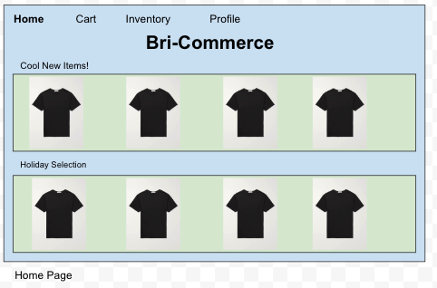
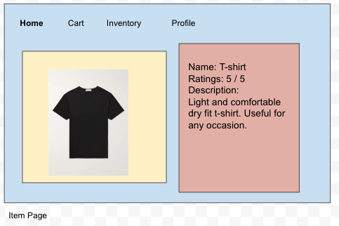
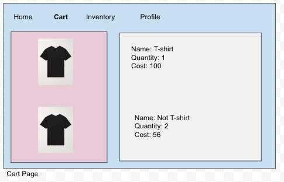
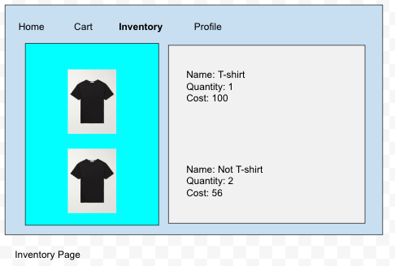
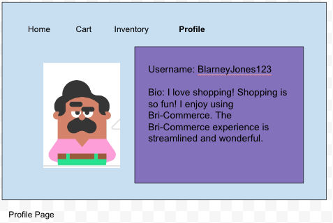
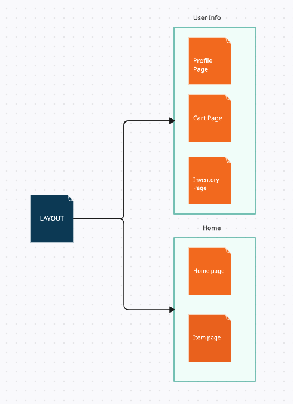
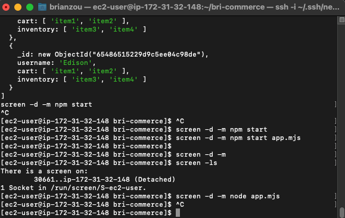
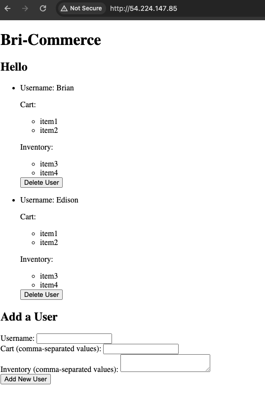

# Bri-Commerce (Brian's E-commerce Site)

## Overview
Sometimes the ordinary e-commerce websites are a bit too boring. I have a simple and fun solution... Bri-Commerce!

Bri-Commerce is an e-commerce website that is stylistic and will allow users to have a fun e-commerce website experience. A user can register and login. Once a user is logged in, they can add items to their shopping carts. These items have descriptions, reviews, and such. Users can simulate "purchasing" items which will add these items to their inventories. Users will have a profile where they can change their profile picture, bio, and name.


## Data Model

The application will store Users, Carts, and Inventories

* users can have one cart
* each cart can have multiple items, items will have prices
* each inventory can have multiple items, items will have descriptions

An Example User:
```javascript
{
    username: "brianzou"
    bio: "A really cool guy"
}

```

An Example Cart with Embedded Items:

```javascript
{
    username: "brianzou"
    items: ["xbox", "tissue box"]
    itemPrices: ["200", "10"] // listed as a string for simplicity
}
```

An Example Inventory with Embedded items:

```javascript
{
    username: "brianzou"
    items: ["hat", "lantern"]
    itemDescriptions: ["nice looking hat", "very bright"]
}
```

#### Database setup (Mac): 
* brew services start mongodb-community
* mongosh
* use finaldb
* db.dropDatabase() // to drop
* db.users.find() // to find
* db.users.insertOne({username: "Brian", bio: "A great guy."});
* db.users.insertOne({username: "James", bio: "Make it double!"});

* db.carts.find();
* db.carts.insertOne({username: "Brian", items: ['apple', 'banna'], itemPrices: [10, 20]});
* db.carts.insertOne({username: "James", items: ['tissue', 'pencil'], itemPRices: [4, 5]});

* db.inventories.find();
* db.inventories.insertOne({username: "Brian", items: ['grape', 'pear'], itemDescriptions: ['good', 'bad']});
* db.inventories.insertOne({username: "James", items: ['salt', 'pepper'], itemDescriptions: ['b', 'c']});


## [Link to Commented First Draft Schema](db.mjs) 

A link to my first draft Schema called BrianSchema (this name will probably be changed in a future iteration)

## Wireframes

* Note that the wireframe and the completed application may be different. I will meeting the minimum requirements without necessarily implementing all of the details in the wireframe.

/home - home page with items you can purchase



/home/item_name - page that shows an item with its review and description



/user/cart_page - page for your shopping cart



/user/inventory_page - page for showing the items you purchased and own



/user/profile - page for showing your profile




Note: I have altered my final project in some of the ways from the wireframe:
1. I will not be including a profile page
2. I will not be including an item page
3. I will not be including images with any of the items.
4. There are other differences from the wireframe. However, I will definitely meet the minimum requirements.


## Site map




## User Stories or Use Cases

1. as a non-registered user, I can register a new account on the site
2. as a user, I can log into the website
3. as a user, I can add items to my shopping cart
4. as a user, I can view an item's page with review and description
5. as a user, I can review an item
6. as a user, I can view my shopping cart with the items I added
7. as a user, I can "purchase" the items from my shopping cart, moving them to my inventory
8. as a user, I can view my inventory with the items I bought
9. as a user, I can modify my own profile page with an image and a bio
10. as a user, I can view my own profile page

## Research Topics

### (2 points) dotenv
    * Configuration management -> dotenv is a good practice to have so I will look more into the proper convention to incorporate dotenv into the project

#### Research on dotenv:
1. .env files are associated with the dotenv package in various programming languges
2. .env is used to manage environment variables. These are useful for separating configuration settings from application code, such as API keys, db passwords, or other secrets you don't want in public source code
3. dotenv is a package in Node.js and other language 
4. .env files help manage differences in development, testing, and production environments

Installation + Setup Process
```
npm install dotenv
```

1. Create file called .env in root directory
2. Add environment specific variables in the form of NAME=VALUE, such as:

```
DB_HOST = localhost
DB_USER = root
DB_PASS = 123
```

In the context of my project, .env stores the mongodb DSN. In my local, it is localhost, while in my actual deployment it is the AWS address. To load .env, we use process.env.DB_HOST

It is good practice to never commit the .env to version control. We do this by putting our .env in our gitignore file

Our use cases for .env can be summarized as
* Storing credentials: API keys, DB passwords, sensitive information
* Configuration Settings: settings for development, testing, and production environment 
* Feature Flags: Enable/disable features in different environments without changing the codebase

### (4 points) Tailwind.CSS
    * Using CSS framework -> I heard tailwind is a good framework for CSS so I will look more into it

#### Research on tailwind.css:
Some key features of tailwind are:
1. Utility-First: Tailwind uses utility classes to style elements. These are small, single-purpose classes that control one CSS property (like padding, margin, font size, etc.).
2. Responsive Design: Tailwind includes responsive variants for each utility, making it easy to build responsive designs.
3. Customization: It offers deep customization through a configuration file, allowing you to define your design system
4. Performance: Since you use only the classes you need the final CSS bundle can be very small

To get started, you want to
```
npm install -D tailwindcss
npx tailwindcss init
npx tailwindcss -i ./public/stylesheets/input.css -o ./public/stylesheets/output.css --watch
```

We have to run the
```npx tailwindcss -i ./public/stylesheets/input.css -o ./public/stylesheets/output.css --watch```
any time we update our file to have the changes reflected in our tailwind output css file. 

### (5 points) Amazon AWS
    * EC2 instance (or anything more appropriate), planning to deploy for long term

#### Research on AWS: To deploy project to Amazon AWS + custom domain, the following steps should be done:
1. Via Amazon Amplify, link GitHub repo to Amplify to create a serverless app
2. To connect to a custom domain, navigate to Route 53 and create a new hosted zone
3. Under the hosted zone, create a new hosted zone with the respective domain
4. Navigate to domain provider (e.g. GoDaddy.com), and update to DNS management
5. Update your nameservers to the respective ones provided by the hosted zone on AWS
e.g. ns-1234.awsdns-12.org, ns-12.awsdns-12.com, ns-1234.awsdns-12.co.uk, ns-123.awsdns-12.net
6. Update the DNS records by adding a new CNAME entry with the name provided by AWS
7. Wait about 24-48 hours for the updates to propogate, after which your website should now be hosted on AWS and visible on your domain

#### Alternatively, deploying an EC2 instance
1. Used commandline, following AWS commands outlined in source 2
2. After connecting, complete installations in the command line using sudo
3. Install necessary packages and set up Mongo
4. Run screen permanently via "screen -d -m", "screen -d -m node app.mjs"
5. Visit app via public ip address below

#### [Link to AWS Deployment](http://54.224.147.85/)

#### Proof of deployment




Total points: 11/10

## [Link to Initial Main Project File](app.mjs) 

A link to the main project file


#### Github commit to alternative origin
git remote set-url --add --push origin https://github.com/nyu-csci-ua-0467-001-002-fall-2023/final-project-brianzou03.git 
git remote set-url --add --push origin https://github.com/brianzou03/bri-commerce.git

#### Additional notes:
(4 points) minimum 2 x any of the following (can be the same): ...
or use any of these built-in higher order functions found in Array.prototype: map, reduce, filter
I use map twice in app.mjs


(8 points) stability / security
simple validation on user input to prevent application from crashing
doesn't allow user input to be displayed unescaped directly on page
pages that require authentication cannot be accessed without authentication
data specified as private to a user cannot be viewed by another user
etc.


npm install pm2 -g

## Annotations / References Used

1. [AWS Amplify Deployment Documentation](https://aws.amazon.com/getting-started/guides/deploy-webapp-amplify/)
2. [EC2 Node + Mongo Deployment video](https://www.youtube.com/watch?v=7vf210p2tJg)
3. [EC2 Setup Guide](https://docs.aws.amazon.com/AWSEC2/latest/UserGuide/EC2_GetStarted.html)
4. [Tailwind CSS documentation](https://tailwindcss.com/docs/utility-first)
5. [Tailwind VSCode setup](https://tailwindcss.com/docs/editor-setup)
6. [dotenv documentation](https://www.npmjs.com/package/dotenv)
7. [dotenv guide](https://medium.com/@thejasonfile/using-dotenv-package-to-create-environment-variables-33da4ac4ea8f)


